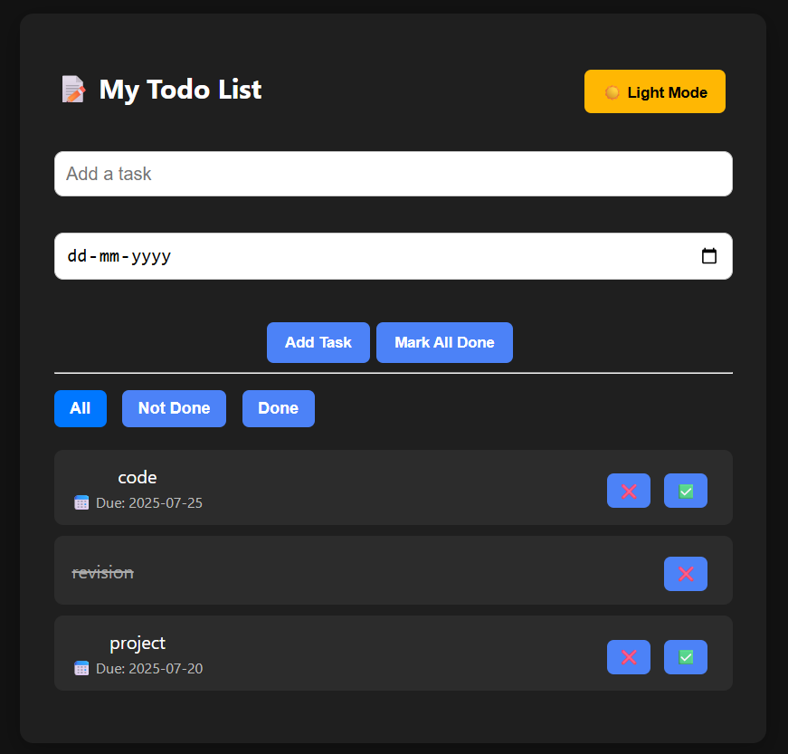
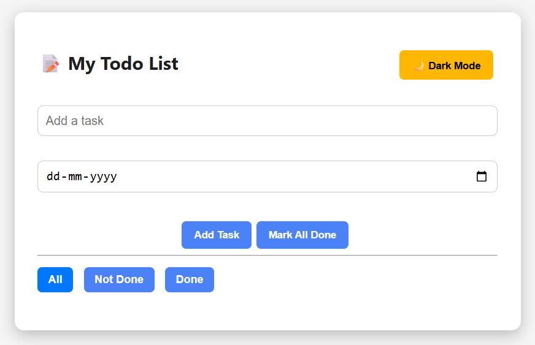

# ✅ Todo List App with Dark/Light Mode, Due Dates, Edit, and Local Storage

A modern and feature-rich Todo List application built with **React**, supporting:

- 🔁 Real-time task updates
- ✏️ Task editing
- 📅 Due date tracking
- 🔔 Highlight for tasks due today
- 🌗 Light/Dark mode toggle
- 💾 Persistent storage using Local Storage

---

## 📸 Screenshots

<p align="center">
  
  <br /><br />
  
</p>


---

## 🚀 Features

| Feature               | Description                                 |
|-----------------------|---------------------------------------------|
| ✅ Add Tasks          | Add new tasks using the input field         |
| ✏️ Edit Tasks         | Double-click a task to edit                 |
| 📅 Due Dates          | Set a due date while creating tasks         |
| 🔔 Due Today Alert    | Highlights tasks due today in red           |
| 🌙 Light/Dark Mode    | Toggle between dark and light themes        |
| 💾 Local Storage      | Tasks are saved even after page reload      |
| 🔍 Filter Tasks       | Filter by All, Done, or Not Done            |

---

## 🛠️ Tech Stack

- ⚛️ **React** (with Hooks)
- 🧠 **uuid** (for unique task IDs)
- 💡 **CSS** (custom light/dark theming)

---

## 📁 Project Structure

todo-list-react/
├── TodoList.jsx # Main React component
├── index.css # Styling and themes
├── App.jsx / main.jsx # Entry point for the component
├── README.md # Project overview
└── package.json # Project metadata


---

## 🧑‍💻 Setup Instructions

1. **Clone the repository**
   ```bash
   git clone https://github.com/ShatyamYograj/todo-list-react.git
   cd todo-list-react
  2.Install dependencies
  
      npm install
  
  3.Start the development server
  
      npm run dev
  
  4.Open in browser: http://localhost:5173 (or similar)

## ⚙️ Build for Production
    npm run build
## 📌 Important Notes
- Double-click a task to enable editing.

- Due dates are optional. If set, they are displayed below the task.

- Tasks due today are highlighted in red for visibility.

- Theme preference is not saved yet; you can add this feature using localStorage if needed.

## 📃 License
This project is licensed under the MIT License.
</br>

## 🙋‍♂️ Author
Shatyam Yograj
🌐 [LinkedIn](https://www.linkedin.com/in/shatyam-yograj-54588a259/) | 📫 shatyamyograj11@gmail.com]
